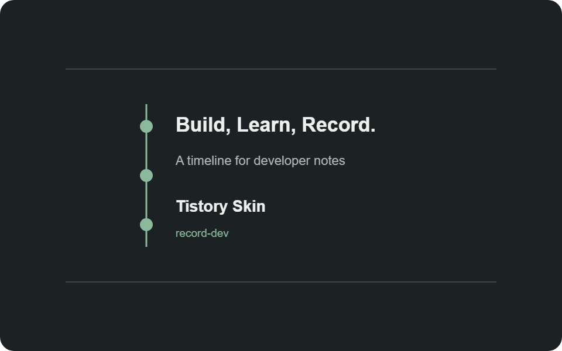

# 티스토리 스킨을 직접 만들며 배운 것들

개발하면서 만난 문제와 해결 과정을 오래 쌓아둘 공간이 필요했다. 트러블슈팅이나 코드 리뷰뿐 아니라 대회 후기와 회고도 함께 기록하고 싶었다. 기존 스킨을 조금 수정하는 방법도 있었지만, 앞으로 글이 많아졌을 때 다시 찾기 쉬운 구조를 직접 설계해 보기로 했다.



> 완성된 화면부터 정한 것이 아니라, 더미 데이터를 채운 화면을 계속 살펴보며 구조와 간격을 다듬었다.

## 왜 직접 만들었나

처음에는 단순한 목록형 블로그를 생각했다. 하지만 기록할 글의 종류를 나열해 보니 요구사항이 조금씩 늘어났다.

- 트러블슈팅 기록은 제목과 요약만 보고도 문제를 빠르게 찾을 수 있어야 한다.
- 코드 리뷰 글은 긴 본문과 코드 블록을 편하게 읽을 수 있어야 한다.
- 대회 후기와 회고는 기술 글과 구분되면서도 같은 흐름 안에 있어야 한다.
- 연관된 글은 시리즈 순서대로 이어서 읽을 수 있어야 한다.

결국 예쁜 첫 화면보다 **기록이 쌓인 뒤에도 탐색하기 쉬운 구조**가 더 중요하다는 결론을 내렸다.

## 더미 데이터로 구조부터 검증하기

실제 글을 먼저 작성하지 않고 날짜, 제목, 요약, 카테고리가 서로 다른 예시 글을 만들었다. 긴 제목, 대표 이미지가 있는 글과 없는 글, 여러 단계의 카테고리를 함께 배치했다.

더미 데이터를 사용하니 빈 화면에서는 보이지 않던 문제가 금방 드러났다. 제목만 클릭되는 글 목록은 클릭 영역이 지나치게 좁았고, 타임라인의 원만 움직이는 호버 효과는 글 블록과 따로 노는 느낌이 들었다. 모바일에서는 날짜와 본문 사이의 간격도 다시 조정해야 했다.

그래서 지금의 홈 화면은 다음 원칙으로 정리했다.

1. 글을 월별 타임라인으로 보여준다.
2. 제목, 요약, 날짜를 포함한 블록 전체를 클릭할 수 있게 한다.
3. 마우스를 올리면 타임라인 원과 글 블록이 함께 반응한다.
4. 대표 이미지가 있는 글만 썸네일을 표시한다.
5. 장식보다 제목과 요약의 가독성을 우선한다.

## 티스토리 치환자에 데이터 연결하기

티스토리 스킨은 일반 HTML과 비슷하지만 실제 글 데이터는 치환자로 전달된다. 예를 들어 글 제목, 링크, 요약, 대표 이미지는 각각 티스토리 전용 치환자를 사용해야 한다.

```html
<a href="[##_article_rep_link_##]">
  [##_article_rep_title_##]
</a>
<p>[##_article_rep_summary_##]</p>
```

먼저 독립된 미리보기 페이지에서 HTML과 CSS를 검증한 뒤, 확정된 위치에 치환자를 연결했다. 이렇게 작업하면 디자인 문제와 티스토리 데이터 문제를 분리해서 확인할 수 있다.

## 카테고리는 트리로 만들기

개발 글은 주제가 계속 세분화된다. 예를 들어 `CS` 아래에 네트워크와 운영체제가 있고, 개발 아래에는 백엔드와 인프라가 생길 수 있다. 모든 항목을 한 줄 목록으로 펼쳐두면 사이드 영역이 빠르게 길어진다.

티스토리가 출력한 카테고리 구조를 기반으로 하위 목록을 접고 펼치는 버튼을 추가했다. 덕분에 전체 구조는 유지하면서 지금 필요한 가지만 열어볼 수 있다.

## 긴 글을 위한 목차

트러블슈팅이나 개념 정리 글은 본문이 길어지는 경우가 많다. 글 안의 `h2`, `h3` 제목을 읽어 오른쪽 목차를 자동으로 만들고, 스크롤 위치에 따라 현재 읽는 부분을 표시하도록 했다.

처음에는 본문과 목차 사이가 너무 넓어 서로 다른 영역처럼 보였다. 콘텐츠 폭과 간격을 다시 조절해 목차가 본문에 자연스럽게 붙도록 수정했다. 작은 화면에서는 목차를 본문 위로 이동시켜 가로 공간이 부족해지지 않도록 했다.

## 다크 모드와 라이트 모드

기본 화면은 코드와 잘 어울리는 흑연색 다크 모드로 정했다. 강조색은 너무 선명한 초록 대신 채도를 낮춘 세이지 계열을 사용했다. 라이트 모드는 카드와 배경의 대비를 줄이고 흰색을 중심으로 구성했다.

색을 직접 지정하기보다 CSS 변수로 관리하니 두 테마의 대비와 강조색을 한곳에서 조정할 수 있었다.

```css
:root {
  --bg: #15191b;
  --text: #edf0ed;
  --green: #8bb99c;
}
```

## 시리즈 기능은 직접 보완하기

티스토리에는 태그 기능은 있지만, 글의 순서를 정하고 진행률을 보여주는 별도의 시리즈 기능은 스킨 치환자로 제공되지 않는다. 그래서 설정 파일에 시리즈 제목과 글 주소, 읽는 순서를 등록하는 방식을 사용했다.

시리즈에 포함된 글을 방문하면 읽은 글 수를 브라우저에 저장하고, 다음 글과 이전 글을 이어서 볼 수 있게 했다. 관리할 글이 많아지면 설정을 자동으로 만드는 방법도 추가할 예정이다.

## GitHub에서 미리보기와 설치 파일 만들기

스킨 파일은 GitHub에서 관리한다. `main` 브랜치에 변경사항을 올리면 GitHub Actions가 두 가지 결과물을 만든다.

- GitHub Pages에 홈과 글 화면 미리보기 배포
- 티스토리에 등록할 스킨 ZIP 생성

브라우저 미리보기는 아래 주소에서 확인할 수 있다.

<https://rudeore-098.github.io/record-dev-tistory-skin/preview/>

티스토리의 공식 스킨 업로드 API는 없기 때문에 마지막 등록은 관리자 화면에서 직접 진행해야 한다. 대신 빌드 과정에서 필수 파일을 검사하고 ZIP을 만들어 실수를 줄였다.

## 마무리

이번 작업에서 가장 크게 배운 점은 디자인을 한 번에 완성하려 하지 않는 것이었다. 더미 데이터를 넣고 실제로 클릭하고, 긴 제목과 좁은 화면을 확인하면서 작은 불편을 하나씩 없애는 과정이 결과를 더 좋아지게 했다.

앞으로 실제 글을 쌓으면서 검색 결과 화면, 코드 블록, 시리즈 관리 방법을 계속 다듬을 예정이다. 이 글은 완성된 스킨의 소개이면서 앞으로 바뀌어 갈 기록의 시작점이다.

---

추천 카테고리: `프로젝트 / 블로그`

추천 태그: `Tistory`, `티스토리스킨`, `HTML`, `CSS`, `JavaScript`, `GitHubActions`, `개발블로그`
